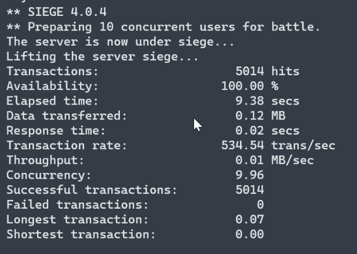

<a id="readme-top"></a>

<!-- PROJECT SHIELDS -->
<!--
*** I'm using markdown "reference style" links for readability.
*** Reference links are enclosed in brackets [ ] instead of parentheses ( ).
*** See the bottom of this document for the declaration of the reference variables
*** for contributors-url, forks-url, etc. This is an optional, concise syntax you may use.
*** https://www.markdownguide.org/basic-syntax/#reference-style-links
-->
[![Contributors][contributors-shield]][contributors-url]
[![Forks][forks-shield]][forks-url]
[![Stargazers][stars-shield]][stars-url]
[![Issues][issues-shield]][issues-url]
[![MIT License][license-shield]][license-url]
[![LinkedIn][linkedin-shield]][linkedin-url]

<!-- 
TODO:
image logo
search "demo video" and change link

 -->

<!-- PROJECT LOGO -->
<br />
<div align="center">
  <a href="https://github.com/biswajit-k/log-ingester-elasticsearch">
    
  </a>

<h3 align="center">LogFlow Insight</h3>

  <p align="center">
    Ingesting Massive Volumes, Unleashing Real-Time Queries
    <br />
    <a href="https://github.com/biswajit-k/log-ingester-elasticsearch"><strong>Explore the docs »</strong></a>
    <br />
    <br />
    <a href="https://youtu.be/JjedCSq7-J0">View Demo</a>
    ·
    <a href="https://github.com/biswajit-k/log-ingester-elasticsearch/issues">Report Bug</a>
    ·
    <a href="https://github.com/biswajit-k/log-ingester-elasticsearch/issues">Request Feature</a>
  </p>
</div>


<!-- TABLE OF CONTENTS -->
<details>
  <summary>Table of Contents</summary>
  <ol>
    <li>
      <a href="#about-the-project">About The Project</a>
    </li>
    <li>
      <a href="#project-description">Project Description</a>
      <ul>
        <li><a href="#built-with">Built With</a></li>
        <li><a href="#system-design">System Design</a></li>
        <li><a href="#user-interface">User Interface</a></li>
        <li><a href="#performance">Performance</a></li>
        <li><a href="#video-demo">Video Demo</a></li>
      </ul>
    </li>
    <li>
      <a href="#getting-started">Getting Started</a>
      <ul>
        <li><a href="#prerequisites">Prerequisites</a></li>
        <li><a href="#installation">Installation</a></li>
        <li><a href="#folder-structure">Folder Structure</a></li>
      </ul>
    </li>
    <li><a href="#usage">Usage</a></li>
    <li><a href="#future-improvements">Future Improvements</a></li>
    <li><a href="#contributing">Contributing</a></li>
    <li><a href="#license">License</a></li>
    <li><a href="#contact">Contact</a></li>
    <li><a href="#acknowledgments">Acknowledgments</a></li>
  </ol>
</details>


<!-- ABOUT THE PROJECT -->
## About The Project


https://github.com/biswajit-k/log-ingester-elasticsearch/assets/76483357/298fa716-4fda-43de-ad11-3ab5738c0d3f


<p align="right">(<a href="#readme-top">back to top</a>)</p>


## Project Description

LogFlow Insight is a robust log ingester and real-time log analysis tool.

The key features are:
* **Easy method to store logs**: Simple HTTP server that can accept logs from any device or service
* **Intuitive UI**: Effortlessly query logs based on multiple filters
* **High Throughput**: Able to handle large volume of log ingestion
* **Real-Time Analysis**: Logs are available to query as soon as they are ingested
* **Speed**: Get query results in lightning-fast speed
* **High Availability**: Deploy once and use from anywhere, anytime
* **Scalable**: Scale horizontally with simple configuration tweaks
* **Easy Setup**: Follow few simple installation steps to get started quickly


### Built With

* [![ElasticSearch]][elastic-url]
* [![kafka]][kafka-url]
* [![FastAPI]][fastapi-url]
* [![Flask]][flask-url]
* [![Docker]][docker-url]
* [![bootstrap]][bootstrap-url]
* [![jquery]][jquery-url]

<p align="right">(<a href="#readme-top">back to top</a>)</p>

### System Design

The software is designed to work as a distributed system with client-facing server for logs ingestion(using FastAPI) and a UI frontend for searching logs(using Flask). Kafka brokers are used to asynchronously handle high volume of logs sent by the ingester server. Kafka-Connect is used to consume logs from Kafka topics, serialize the data and send for storage. Elasticsearch is used as the database for quick indexing and full-text search capabilities. Justification for the decisions for each of the components is given below-

* **Elasticsearch**: 
  * **Lucene Engine**: It is built on top of Apache Lucene which uses an inverted index which is a data structure optimized for quick full-text searches and aggregate operations for data analysis.
  * **Distributed and Sharded Architecture**: Elasticsearch distributes data across multiple cluster nodes and divides it into shards, allowing parallel processing and fault tolerance.
  * **Near Real-Time Search**: Elasticsearch offers near real-time search capabilities. As soon as data is indexed, it becomes searchable.
* **Kafka**:
  * **High Volume**: Kafka is designed for high-throughput scenarios. Kafka's design minimizes disk I/O, making it efficient in handling massive message volumes with minimal latency.
  * **Fault-Tolerance**: Kafka replicates data across multiple brokers, ensuring that even if some nodes fail, data remains available. 
  * **Scalability**: Kafka is horizontally scalable, allowing it to handle enormous volumes of data by distributing it across multiple nodes. It gurantees no data loss.
* **Kafka-Connect**: 
  * **Batch-Processing**: Kafka Connect utilize batch processing mechanisms, enabling it to collect and process data in larger chunks or batches thereby increasing throughput and minimizing load on database.
  * **Reliability**: Kafka-Connect includes support for fault recovery, ensuring that if a connector or node fails, the system can recover and resume operations.
  * **Schema Evolution**: Kafka Connect supports schema evolution, allowing for changes in data structure over time without disrupting the data pipeline.
* **FastAPI**:
  * **Concurrency**: FastAPI leverages Python's *asyncio* to handle asynchronous operations. It allows handling multiple concurrent requests without blocking, maximizing the server's efficiency.
  * **Performance**: FastAPI is built on top of Starlette and Pydantic. Starlette is a high-performance web framework, while Pydantic provides quick data serialisation.
* **Flask**:
  * **Lightweight and Flexible**: Flask is designed as a minimal framework to get started. It has the support of multiple extensions for different use cases and integration.
  * **Fewer Dependencies**: Flask has minimal dependencies beyond Python itself. This makes deployment and maintenance easier.
  * **Quick Setup**: Flask allows quick setup to get a basic web server up and running with just a few lines of code.

Below is the basic diagram for the system. I would highly recommend you check out my video explanation of the complete project [here](https://youtu.be/JjedCSq7-J0) to get a better understanding.

![System Design][system-design-kafka]

Note that I have not used load balancer in the demo. I would highly recommend it if you are going for production.

<p align="right">(<a href="#readme-top">back to top</a>)</p>


### User Interface

![Product Name Screen Shot][product-screenshot]

<p align="right">(<a href="#readme-top">back to top</a>)</p>


### Performance
Load test has been performed on this system using [siege](https://github.com/JoeDog/siege). Test is run on a linux based system with 16GB RAM and all services running in docker containers.
Note that single instance of FastAPI, Elasticsearch and Kafka Broker is used without load balancing.



<p align="right">(<a href="#readme-top">back to top</a>)</p>

### Video Demo
I have create a Youtube video showing the demo of this system, the link to which is [here](https://youtu.be/JjedCSq7-J0).

<!-- GETTING STARTED -->
## Getting Started

To get a local copy up and running follow these simple example steps.

### Prerequisites

Make sure that you have docker installed. Docker would help us to work with the above components using containers very easily. If you don't have Docker, visit the [official site](https://docs.docker.com/get-docker/) to install it.

### Installation

1. Clone the repo
   ```sh
   git clone https://github.com/biswajit-k/log-ingester-elasticsearch.git
   ```
2. Head into `/connect-plugins` folder and unzip the `.zip` file inside the folder itself
   ```sh
   cd connect-plugins
   unzip confluentinc-kafka-connect-elasticsearch-14.0.11.zip
   ```
  
2. Get the components running in containers according to `docker-compose.yaml` configurations
    ```sh
      docker compose up -d
    ```

Wait until `kafka-connect` becomes `healthy`. Finally,
below services will be available-
* Log Ingester Server: `http://localhost:3000`
* Query Interface: `http://localhost:5000`
* Elasticserach: `http://localhost:9200`

You won't need to do anything with Elasticsearch unless you are developing this software.


<p align="right">(<a href="#readme-top">back to top</a>)</p>

### Folder Structure

```
├── docker-compose.yaml
├── .env
├── README.md
├── LICENSE.txt
├── example_log.json
└── connect-plugins
    ├── confluentinc-kafka-connect-elasticsearch-14.0.11.zip
└── ingester
    ├── main.py
    ├── models.py
    ├── config.py
    ├── requirements.txt
    ├── .local.env
    ├── dockerfile
└── query_interface
    ├── templates
        ├── index.html
    ├── app.py
    ├── models.py
    ├── .local.env
    ├── requirements.txt
    ├── dockerfile

```
`.env` file is used for global environment variables when running services inside container.

`.local.env` file contains environment variable for service when it is run outside container locally. 


<p align="right">(<a href="#readme-top">back to top</a>)</p>

<!-- USAGE EXAMPLES -->
## Usage

* **Ingesting Logs**: 

  You can check if the ingester server is started by simply sending a GET request at `http://localhost:3000`, it should give you a simple *hello world* response.
  Now you are ready to ingest logs. Send a POST request to the server at `http://localhost:3000/logs` in the JSON format specified in the `example_log.json` file

* **Query Interface**: 
  
  Simply head over to `http://localhost:5000` to access the interface.

***Note**: You can tailor the format according to your needs by changing the data model in `models.py` and `app/main.py` in both `ingester` and `query_interface` folders*


_For demo, please refer to the [Demo Video](https://youtu.be/JjedCSq7-J0)_

<p align="right">(<a href="#readme-top">back to top</a>)</p>


<!-- ROADMAP -->
## Future Improvements

Some further improvements in design and implementation are mentioned below-

**Enhancing Durability**

  Elasticsearch instances can go down if they get massive loads of data. Also, backing up data takes time and during this time our database would be down. So there are chances of losing log data for that duration . If log data is valuable and we can't afford to lose any of it then we could also add a **transactional database** which would parallelly also store these logs. A transactional database being ACID complaint would ensure that the data is not lost in case Elasticsearch instances go down.


**Improving Elasticsearch Fault Tolerance**

  Having **cluster and replicas** of Elasticsearch instances will ensure that if some instance goes down others are available to index logs and provide search result.


See the [contribution section](#contributing) on how yo propose improvements.

<p align="right">(<a href="#readme-top">back to top</a>)</p>


<!-- CONTRIBUTING -->
## Contributing

Contributions are what makes the open-source community such an amazing place to learn, inspire, and create. Any contributions you make are **greatly appreciated**.

If you have a suggestion that would make this better, please fork the repo and create a pull request. You can also simply open an issue with the tag "enhancement".
Don't forget to give the project a star! Thanks again!

1. Fork the Project
2. Create your Feature Branch (`git checkout -b feature/AmazingFeature`)
3. Commit your Changes (`git commit -m 'Add some AmazingFeature'`)
4. Push to the Branch (`git push origin feature/AmazingFeature`)
5. Open a Pull Request

<p align="right">(<a href="#readme-top">back to top</a>)</p>


<!-- LICENSE -->
## License

Distributed under the MIT License. See `LICENSE.txt` for more information.

<p align="right">(<a href="#readme-top">back to top</a>)</p>


<!-- CONTACT -->
## Contact

Biswajit Kaushik - [linkedin](https://twitter.com/twitter_handle), biswajitkaushik02@gmail.com

Project Link: [https://github.com/biswajit-k/log-ingester-elasticsearch](https://github.com/biswajit-k/log-ingester-elasticsearch)

<p align="right">(<a href="#readme-top">back to top</a>)</p>


<!-- ACKNOWLEDGMENTS -->
## Acknowledgments

* [How Twitter keeps its search systems up and stable at scale by Arpit Bhayani](https://www.youtube.com/watch?v=dOyCq_mMtdI)
* [Structured Streaming Using Flask Kafka PySpark Elasticsearch Kibana](https://github.com/ercan5535/Structured-Streaming-Flask-Kafka-PySpark-Elasticsearch-Kibana)
* [Elasticsearch Docs][elastic-url]

<p align="right">(<a href="#readme-top">back to top</a>)</p>


<!-- MARKDOWN LINKS & IMAGES -->
<!-- https://www.markdownguide.org/basic-syntax/#reference-style-links -->
[contributors-shield]: https://img.shields.io/github/contributors/biswajit-k/log-ingester-elasticsearch.svg?style=for-the-badge
[contributors-url]: https://github.com/biswajit-k/log-ingester-elasticsearch/graphs/contributors
[forks-shield]: https://img.shields.io/github/forks/biswajit-k/log-ingester-elasticsearch.svg?style=for-the-badge
[forks-url]: https://github.com/biswajit-k/log-ingester-elasticsearch/network/members
[stars-shield]: https://img.shields.io/github/stars/biswajit-k/log-ingester-elasticsearch.svg?style=for-the-badge
[stars-url]: https://github.com/biswajit-k/log-ingester-elasticsearch/stargazers
[issues-shield]: https://img.shields.io/github/issues/biswajit-k/log-ingester-elasticsearch.svg?style=for-the-badge
[issues-url]: https://github.com/biswajit-k/log-ingester-elasticsearch/issues
[license-shield]: https://img.shields.io/github/license/biswajit-k/log-ingester-elasticsearch.svg?style=for-the-badge
[license-url]: https://github.com/biswajit-k/log-ingester-elasticsearch/blob/master/LICENSE.txt
[linkedin-shield]: https://img.shields.io/badge/-LinkedIn-black.svg?style=for-the-badge&logo=linkedin&colorB=555
[linkedin-url]: https://linkedin.com/in/biswajit-kaushik
[product-screenshot]: images/screenshot.png
[system-design-fastapi]: images/design-fastapi.png
[system-design-kafka]: images/design-kafka.png
[performance]: images/performance.png
[ElasticSearch]: https://img.shields.io/badge/-ElasticSearch-00bfb3?style=for-the-badge&logo=elasticsearch&logoColor=f9b110
[elastic-url]: https://www.elastic.co/elasticsearch
[FastAPI]: https://img.shields.io/badge/FastAPI-005571?style=for-the-badge&logo=fastapi
[fastapi-url]: https://fastapi.tiangolo.com/
[Flask]: https://img.shields.io/badge/flask-%23000.svg?style=for-the-badge&logo=flask
[flask-url]: https://flask.palletsprojects.com/
[Docker]: https://img.shields.io/badge/docker-%230db7ed.svg?style=for-the-badge&logo=docker&logoColor=white
[docker-url]: https://www.docker.com/
[bootstrap]: https://img.shields.io/badge/Bootstrap-563D7C?style=for-the-badge&logo=bootstrap&logoColor=white
[bootstrap-url]: https://getbootstrap.com
[jquery]: https://img.shields.io/badge/jQuery-0769AD?style=for-the-badge&logo=jquery&logoColor=white
[jquery-url]: https://jquery.com 
[kafka]: https://img.shields.io/badge/Apache%20Kafka-000?style=for-the-badge&logo=apachekafka
[kafka-url]: https://kafka.apache.org/
